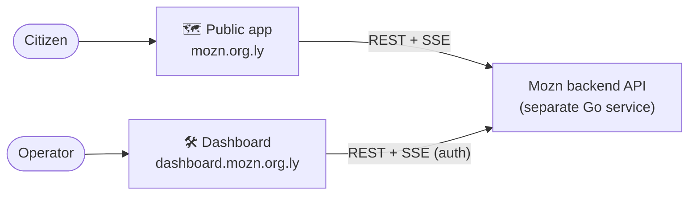

<div align="center">

# Mozn — Early Warning System · Front-ends

**The two web front-ends for Mozn, a weather early-warning platform for Libya.**

Live map for citizens · operator dashboard for MOZN · bilingual (العربية / English) with full RTL.


</div>

---

## What is this?

Mozn watches Libya's weather-station network and warns people before hazardous
conditions hit. This repository contains its **two independent front-ends**:

| App | Path | Audience | What it does |
| --- | --- | --- | --- |
| 🗺️ **Public map app** | [`mozn-public/frontend`](./mozn-public/frontend) | Citizens | Live map of stations, per-station readings, forecasts, and active hazard warnings |
| 🛠️ **Admin dashboard** | [`mozn-dashboard/web`](./mozn-dashboard/web) | MOZN operators | Monitor stations, triage the alert inbox, manage active alerts, tune thresholds, manage users, review history |

Both are **Next.js (App Router) + React + TypeScript** apps that consume the same
**Mozn backend API** — a separate Go service — over REST + a real-time SSE stream.
They are **frontend-only**; the backend (ingestion, alert engines, database, SSE
hub) lives in its own repository. These apps only need its base URL.



---

## Shared stack

- **Next.js 16** (App Router, React Server Components) · **React 19** · **TypeScript** (strict)
- **Tailwind CSS v4** (CSS-first `@theme` design tokens) — no `tailwind.config.js`, no raw hex
- **shadcn/ui** (new-york, on Radix) + **recharts** on the dashboard · **Leaflet** for the public map
- **Server-Sent Events** consumed via `EventSource` → debounced `router.refresh()` for live updates
- Lightweight, **library-free bilingual i18n** (EN + AR) with full RTL

---

## Quick start

**Prerequisites:** Node.js ≥ 18.18 (20+ recommended) · npm · a running Mozn backend API.

Run **both** apps together from the repo root:

```bash
./dev.sh
#  Public app  →  http://localhost:3000
#  Dashboard   →  http://localhost:3001
#  Backend API →  expected at http://localhost:8080  (run the backend repo separately)
```

Or run **one** app on its own:

```bash
# Admin dashboard
cd mozn-dashboard/web
npm install
cp .env.example .env.local     # set API_BASE_URL → the backend origin
npm run dev                    # http://localhost:3000

# Public map app
cd mozn-public/frontend
npm install
cp .env.example .env.local     # set NEXT_PUBLIC_API_BASE → the backend origin
npm run dev                    # http://localhost:3000 (use a different port if the dashboard is running)
```

> Each app is independent. Both need the backend API reachable to load data. In
> production they deploy as **separate origins** (e.g. `mozn.org.ly` and a
> `dashboard.` subdomain) — there is no proxy between them.

---

## Repository layout

```
mozn-frontend/
├── mozn-public/frontend/     # 🗺️  Public map app (Next.js)
├── mozn-dashboard/web/       # 🛠️  Admin dashboard (Next.js)
├── docs/                     # 📚  Project documentation (see below)
├── dev.sh                    # run both apps together for local dev
├── ecosystem.config.js       # PM2 process config (production)
├── CONTRIBUTING.md
└── LICENSE                   # MIT
```

> **No root `package.json` — on purpose.** A root lockfile makes Next.js infer the
> monorepo as the workspace root and compile over a huge scope (very slow dev).
> Each app manages its own dependencies; run `npm install` inside each one.

---

## Documentation

| Guide | What's inside |
| --- | --- |
| [**Architecture**](./docs/architecture.md) | System overview, data-flow diagrams, per-app internals & route maps |
| [**API contract**](./docs/api-contract.md) | The server-only fetch boundary, response envelope, endpoints each app consumes |
| [**i18n & RTL**](./docs/i18n-and-rtl.md) | The bilingual EN/AR system and the logical-utility rules for RTL |
| [**Styling**](./docs/styling.md) | Tailwind v4 `@theme` token model, dark mode, and how the two apps differ |
| [**Deployment**](./docs/deployment.md) | Environment variables, separate-subdomain deploys, PM2 |
| [**Contributing**](./CONTRIBUTING.md) | Local setup, the golden rules, pre-PR checks |

Each app also has its own README: [public](./mozn-public/frontend/README.md) ·
[dashboard](./mozn-dashboard/README.md).

---

## Project conventions

Three rules hold across both apps (details in [`CONTRIBUTING.md`](./CONTRIBUTING.md)):

1. **Bilingual + RTL, always** — every string ships `en` **and** `ar`; use logical
   Tailwind utilities (`ps/pe`, `ms/me`, `start/end`) so Arabic mirrors correctly.
2. **Token-first styling** — colours, spacing, radius and type come from design
   tokens; never hardcode hex.
3. **Reuse before you build** — check existing UI primitives and feature
   components first (shadcn/ui + lucide icons on the dashboard).

---

## License

Released under the [MIT License](./LICENSE).
