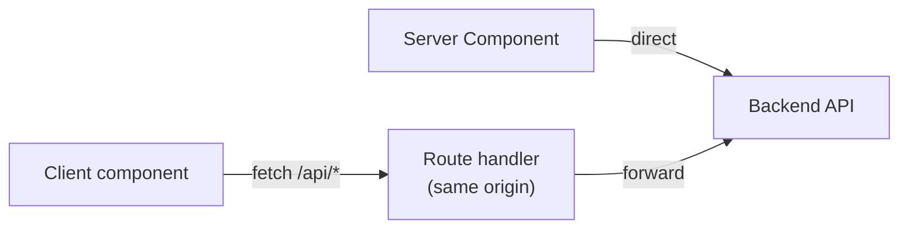

# API Contract

Both front-ends are **typed clients of the Mozn backend API** — a separate Go
service. This document describes how the apps consume that API: the fetch
boundary, the response envelope, and the endpoints each app depends on. It does
**not** document the backend's implementation (that lives in its own repo).

> If you change the shape of data the frontend expects, the backend must change to
> match — and vice versa. Keep the two in lockstep.

---

## The golden boundary: the browser never calls the backend directly

Both apps enforce the same rule:

- **Server Components** and server-only modules fetch the backend directly.
- **Client components** never import the server-only fetch layer. They call a thin
  **same-origin route handler** (`app/api/*`) that forwards to the backend.

This keeps backend origins/tokens off the client, and avoids CORS/mixed-content.
Importing a `server-only` module into a client component is a build error — that's
intentional.



---

## Response envelope

The backend wraps responses in an envelope:

```jsonc
{
  "data":     { /* the payload */ },
  "message":  "optional human message",
  "metadata": { "total": 123, "page": 1, "page_size": 50 },  // pagination
  "code":     "optional_code",
  "error":    "optional_error"
}
```

Both apps unwrap `data` by default and reach for the envelope only when they need
`metadata` (e.g. pagination totals).

---

## Public map app

**Fetch layer:** `components/api/` (`client.ts`, `stations.ts`, `readings.ts`,
`forecasts.ts`, `alerts.ts`, `types.ts`).

- `apiFetch<T>(path, opts)` → returns the unwrapped `data`.
- `apiFetchEnvelope<T>(path, opts)` → returns the full envelope (used by `alerts`
  for `metadata.total`).
- Routing: server-side → `NEXT_PUBLIC_API_BASE` directly; client-side →
  `/api/proxy/[...path]` (which forwards to `MOZN_API_BASE`).
- Caching: pass `revalidate` (→ `next: { revalidate }`) or `fresh: true` for
  `no-store`.

**Endpoints consumed (all under `/public`):**

| Endpoint | Helper | Notes |
| --- | --- | --- |
| `GET /public/stations` | `listStations()` | `?municipality_id`; `revalidate: 60` (or fresh) |
| `GET /public/stations/:id` | `getStation()` | Omits `status`/`active_alerts`/`forecast_alerts`; backfilled from the list |
| `GET /public/stations/nearest` | `listNearestStations()` | `lat`, `lng`, `limit` |
| `GET /public/readings` | `getLatestReading()` | `?station_id`, `page_size: 1` |
| `GET /public/readings/history` | `getReadingsHistory()` | Also fetched client-side on range change |
| `GET /public/forecasts/daily` | `getDailyForecast()` | `?days` |
| `GET /public/alerts` | `listAlerts()` | `severity`/`source`/`region_id`/paged; `station_id` filtered client-side |
| `GET /public/events` | (SSE) | Proxied by `app/api/events` |

**Proxy route** (`app/api/proxy/[...path]`): forwards method + query + body to the
upstream, `cache: no-store`, returns `502 { error: "upstream_unreachable" }` on
failure, and sets a short `s-maxage` on successful GET/HEAD.

---

## Admin dashboard

**Fetch layer:** two server-only files.

- **`lib/backend.ts`** — transport to the backend (`API_BASE_URL`, default
  `http://localhost:8080`). `backendFetch` / `backendData` (read, unwrap envelope,
  `no-store`), `backendMutate` (write; returns `{ ok, status, data, message,
  errorCode }` and never throws except on 401), plus `getCurrentUser()` and
  `loginToBackend()`. Attaches `Authorization: Bearer <jwt>` from the
  `mozn_dash_token` cookie; a 401 throws `AuthError`.
- **`lib/api.ts`** — adapter layer: named getters/writers that shape backend DTOs
  into the client-safe view models in `types/*`.

> Note the dashboard's backend paths are **`/api/...`** (e.g. `/api/stations`), not
> `/api/v1/...`.

**Representative endpoints consumed:**

| Area | Endpoints |
| --- | --- |
| Auth / session | `POST /api/auth/login`, `GET /api/me`, `GET /api/events` (SSE) |
| Dashboard | `GET /api/dashboard/stats`, `GET /api/gov/dashboard` |
| Stations | `GET/POST /api/stations`, `…/:id` (PUT/DELETE), `GET /api/regions`, `/api/municipalities` |
| Alerts | `GET /api/alerts`, `…/:id/<action>` (acknowledge/confirm/reject/resolve/reopen/escalate/…) |
| Thresholds | `GET/POST /api/thresholds`, `…/:id` (PUT/DELETE), `…/:id/revert`, `…/preview`, `…/:id/history` |
| Compound rules | `GET/POST /api/compound-rules`, `…/:id` (PUT/DELETE) |
| Templates | `GET/POST /api/templates`, `…/:id` (PUT/DELETE) |
| Users & access | `GET/POST /api/users`, `…/:id`, `GET /api/roles`, `…/:id/permissions`, `/api/permissions` |
| Config | `GET /api/parameters`, `/api/validation-rules`, `/api/settings`, `/api/audit-logs` |
| Readings | `GET /api/readings`, `GET /api/forecasts` |

**Client-facing proxy handlers** live under `app/api/*` (e.g. `app/api/stations`,
`app/api/alerts/[id]/[action]`, `app/api/thresholds/...`). They attach the JWT and
forward to the backend, so client components never hold the token or the backend
URL.

---

## Authentication summary

| | Public app | Dashboard |
| --- | --- | --- |
| Auth | None (public endpoints) | JWT in httpOnly cookie `mozn_dash_token` |
| Where enforced | — | `(dashboard)/layout.tsx` via `/api/me`; backend re-checks every call |
| Token exposure | — | Never reaches client JS; attached server-side + in the SSE proxy |

---

## When you change the contract

1. Update the backend and the frontend **together**.
2. Update the app's TypeScript types (`components/api/types.ts` in the public app;
   `types/*` + `lib/backend-types.ts` in the dashboard).
3. Re-run `lint` / `typecheck` / `test` in the affected app(s).
