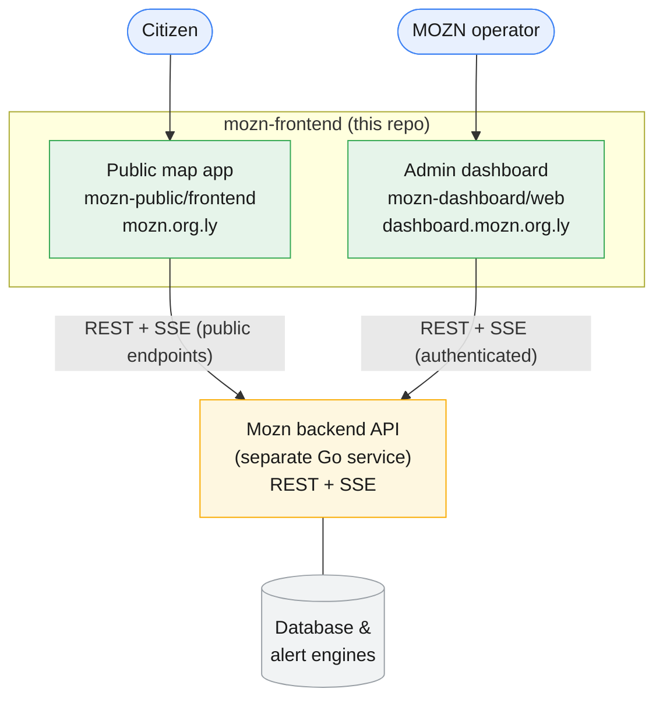
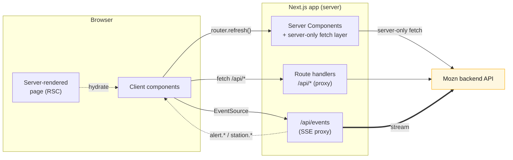
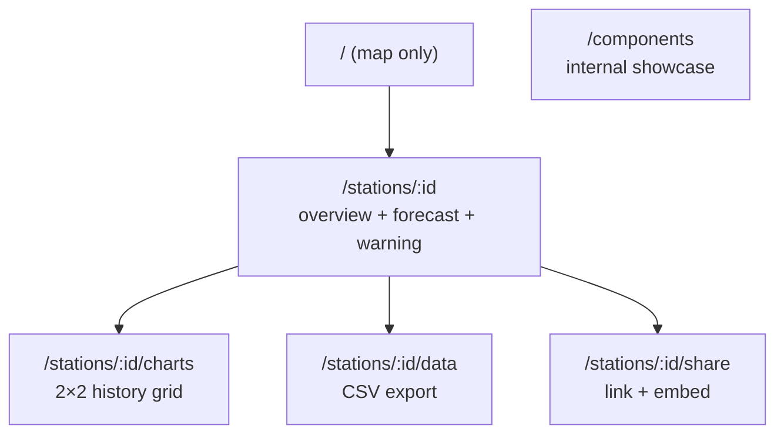
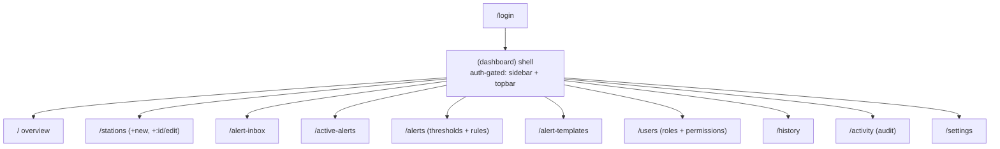

# Architecture

Mozn is a weather **early-warning platform for Libya**. This repository holds its
**two web front-ends**; the backend (ingestion, alert engines, database, SSE hub)
is a separate Go service reached over HTTP.

| App | Path | Audience | Origin (prod) |
| --- | --- | --- | --- |
| Public map app | `mozn-public/frontend` | Citizens | `mozn.org.ly` |
| Admin dashboard | `mozn-dashboard/web` | MOZN operators | `dashboard.mozn.org.ly` |

Both are **Next.js 16 (App Router, RSC) + React 19 + TypeScript** apps, styled with
**Tailwind v4** design tokens, **bilingual (EN/AR) with full RTL**, and updated
live over **Server-Sent Events**. They are deployed and operated **independently**
— there is no shared build and no proxy between them.

---

## System overview

The two apps consume the **same backend** but different surfaces of it: the public
app calls unauthenticated `/public/*` endpoints; the dashboard calls authenticated
`/api/*` endpoints with a JWT.

---

## Data flow

Both apps follow the same principle: **the browser never talks to the backend
directly.** Server Components fetch server-side, and anything the browser needs
goes through a thin same-origin route handler. This hides backend URLs/tokens and
sidesteps CORS/mixed-content.

**The live-update loop:** the app opens an `EventSource` against its own
`/api/events`, which proxies the backend SSE stream (attaching the JWT in the
dashboard, since `EventSource` can't send headers). On an `alert.*` / `station.*`
event the client shows a toast/notification and triggers a **debounced
`router.refresh()`**, which re-runs the Server Components and repaints with fresh
data — no full reload, and (on the map) without resetting the user's pan/zoom.

---

## Public map app internals

- **Shell:** the `(app)` route group renders `TopBar` + a full-page `MapCanvas`;
  the selected station opens a side rail (nested routes under
  `stations/[stationId]`).
- **Map:** `features/map` uses Leaflet directly (`ssr: false` dynamic import),
  drawing Libya's GeoJSON outline and rendering station pins whose colour encodes
  the worst of operational status + active/forecast alerts.
- **Data:** `components/api` with a `{ data, metadata }` envelope; server-side
  fetches hit the backend directly, client-side fetches go through
  `/api/proxy/[...path]`.
- **State:** `StationsProvider` (server-fetched list) and `LanguageProvider`;
  `EventsListener` drives live refresh. No Redux/Zustand.

See [`mozn-public/frontend/README.md`](../mozn-public/frontend/README.md).

---

## Admin dashboard internals

- **Auth:** real JWT in an **httpOnly cookie** (`mozn_dash_token`). The
  `(dashboard)/layout.tsx` server component gates every screen via `/api/me` and
  redirects to `/login` on failure (no `middleware.ts`). Access is
  **permission-based** (`RouteGuard` + per-nav `permission`).
- **Data:** two server-only layers — `lib/backend.ts` (transport, attaches the JWT,
  unwraps the envelope) and `lib/api.ts` (adapters → client-safe view models).
  Client components use same-origin proxy handlers under `app/api/*`.
- **Real-time:** `app/api/events` (SSE proxy) + `events-provider` (toasts +
  coalesced refresh) + optional `auto-refresh` polling fallback.
- **UI:** shadcn/ui (new-york) primitives + recharts; a Leaflet station-health map.

See [`mozn-dashboard/README.md`](../mozn-dashboard/README.md).

---

## Shared conventions

- **Bilingual EN/AR + RTL** everywhere — [`i18n-and-rtl.md`](./i18n-and-rtl.md).
- **Token-first Tailwind v4** styling, no raw hex — [`styling.md`](./styling.md).
- **Server-only data layer + proxy handlers** — [`api-contract.md`](./api-contract.md).
- **Independent deployments** on separate origins — [`deployment.md`](./deployment.md).
